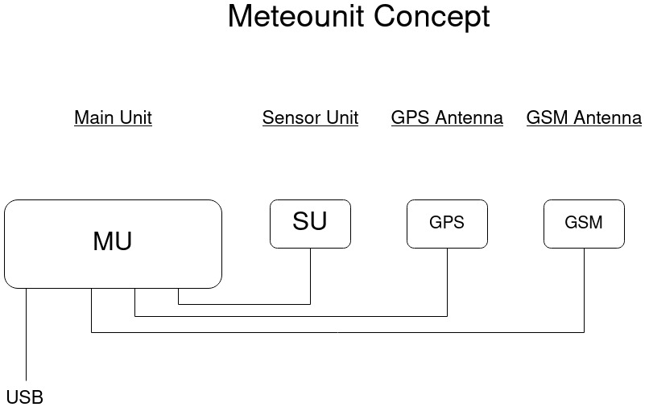

# Meteounit

The Meteounit is an Electronic Control Unit for vehicles that will provide the following features:
- Measurement of outside air temperature
- Measurement of air pressure
- Measurement of air humidity
- Measurement of particulate matter
- Uploading of the values to OpenWeatherMap

## Main Unit (MU)
The Main Unit is based on the BeagleBone Black single-board computer. It provides the computing power and handles communication with all other components.

## Sensor Unit (SU)
All meteorological sensors are packed in the Sensor Unit. It is connected to the Main Unit via GPIOs. In the future, communication will maybe also be possible with CAN bus.

## Electronic
We will provide all schematics and a list of components to build all components. Especially the sensor box.